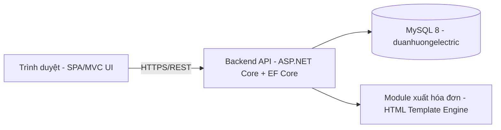
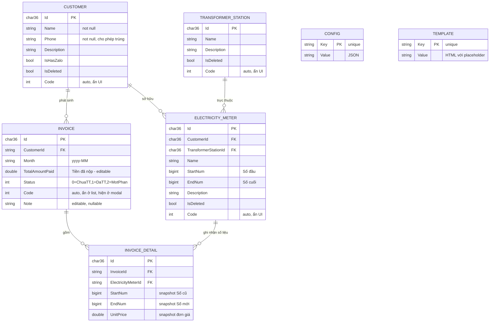

# TÀI LIỆU ĐẶC TẢ YÊU CẦU PHẦN MỀM (SRS)
## Phần mềm Quản lý Khách hàng & Hóa đơn Tiền Điện

| | |
|---|---|
| **Tên dự án** | Electrical Management – Quản lý khách hàng & hóa đơn điện |
| **Phiên bản** | 1.2 |
| **Ngày biên soạn** | 2026-09-10 |
| **Nguồn yêu cầu gốc** | `Document-SRS/Phần mềm hóa đơn điện.docx` + bộ ảnh chụp giao diện mẫu + **database production thực tế** `Document-SRS/db_backup.sql` (MySQL 8, database `duanhuongelectric`) |
| **Chuẩn tham chiếu** | Cấu trúc phỏng theo IEEE 830 (Software Requirements Specification) |

> **Cập nhật v1.1**: đã đối chiếu và hiệu chỉnh lại toàn bộ mô hình dữ liệu (mục 3) cho khớp 100% với schema thực tế lấy từ bản sao lưu (dump) database production đang vận hành, thay vì chỉ dựa trên suy luận từ hình ảnh. Xem mục 3.4 để biết chi tiết các điểm đã xác nhận/điều chỉnh.
>
> **Cập nhật v1.2**: khách hàng đã chốt toàn bộ các vấn đề còn mở (mục 10) — xóa hóa đơn dùng soft-delete, không cần hoàn tác `StartNum`, chấp nhận hành vi join tên đồng hồ/trạm động, bắt buộc bổ sung bảng `Users` + xác thực bằng JWT token, không phân quyền nhiều cấp. Xem mục 3.5 (thay đổi schema bắt buộc) và mục 10.

---

## 1. Giới thiệu (Introduction)

### 1.1 Mục đích
Tài liệu này đặc tả đầy đủ, không mơ hồ các yêu cầu chức năng và phi chức năng của phần mềm **Quản lý khách hàng & Hóa đơn tiền điện**, dùng làm cơ sở duy nhất để:
- Thiết kế cơ sở dữ liệu và kiến trúc hệ thống.
- Lập trình (backend API, frontend UI).
- Kiểm thử (test case bám theo tiêu chí chấp nhận – Acceptance Criteria).
- Nghiệm thu sản phẩm với khách hàng.

### 1.2 Phạm vi (Scope)
Hệ thống là một ứng dụng quản trị nội bộ (admin web app) cho phép nhân viên/quản lý:
1. Đăng nhập/Đăng xuất bằng tài khoản có sẵn.
2. Quản lý danh sách khách hàng và các đồng hồ điện (công tơ) của từng khách hàng.
3. Tạo/xuất hóa đơn tiền điện theo tháng, quản lý trạng thái thanh toán.
4. Xem thống kê doanh thu theo tháng.
5. Cấu hình giá điện và thông tin hiển thị trên hóa đơn.

Ngoài phạm vi (out of scope): trang đăng ký (Sign up), quản lý phân quyền nhiều vai trò, thanh toán online, gửi hóa đơn tự động qua Zalo/SMS (trường "Zalo" chỉ là cờ đánh dấu khách có Zalo hay không, không tích hợp gửi tin nhắn).

### 1.3 Đối tượng sử dụng tài liệu
- Lập trình viên Backend/Frontend triển khai code.
- Tester xây dựng test case.
- Quản lý dự án / khách hàng để đối chiếu, nghiệm thu.

### 1.4 Định nghĩa, thuật ngữ, viết tắt

| Thuật ngữ | Ý nghĩa |
|---|---|
| Khách hàng (Customer) | Người dùng điện, chủ thể sở hữu một hoặc nhiều đồng hồ điện |
| Đồng hồ điện / Công tơ (Meter) | Thiết bị đo điện, thuộc về một khách hàng, gắn tại một trạm biến áp |
| Trạm biến áp (Station) | Trạm điện mà đồng hồ trực thuộc (Trạm 1, Trạm 2, …) |
| Số đầu (Old Index) | Chỉ số công tơ tại thời điểm chốt kỳ trước (baseline để tính điện năng tiêu thụ kỳ tới) |
| Số cuối (New Index) | Chỉ số công tơ mới nhất được cập nhật (ghi số điện thực tế) |
| Điện năng tiêu thụ | = Số cuối − Số đầu |
| Hóa đơn (Invoice) | Chứng từ tiền điện của một khách hàng phát sinh cho một tháng cụ thể |
| Đã cập nhật (đồng hồ) | Đồng hồ đã được nhân viên ghi số mới (Số cuối) khác với Số đầu của kỳ hiện tại, sẵn sàng để xuất hóa đơn |
| SRS | Software Requirements Specification |
| FR | Functional Requirement (Yêu cầu chức năng) |
| NFR | Non-Functional Requirement (Yêu cầu phi chức năng) |

### 1.5 Tài liệu tham khảo
- File Word gốc: `Document-SRS/Phần mềm hóa đơn điện.docx`
- 13 ảnh chụp màn hình wireframe do khách hàng cung cấp (giao diện quản lý khách hàng, thêm/sửa khách hàng, xuất hóa đơn, quản lý hóa đơn, xem/sửa hóa đơn, thống kê, cấu hình).

---

## 2. Mô tả tổng quan (Overall Description)

### 2.1 Bối cảnh sản phẩm
Sản phẩm độc lập (standalone), kiến trúc web admin dashboard (tham chiếu theo phong cách giao diện *SB Admin*), gồm 1 vai trò người dùng duy nhất: **Admin/Nhân viên vận hành**. Không có phần dành cho khách hàng cuối (end-customer) tự tra cứu.

### 2.2 Tổng quan chức năng
| # | Module | Mô tả ngắn |
|---|---|---|
| 1 | Đăng nhập / Đăng xuất | Xác thực bằng số điện thoại + mật khẩu |
| 2 | Quản lý khách hàng | CRUD khách hàng + đồng hồ điện, tìm kiếm, lọc, phân trang, xóa hàng loạt, kích hoạt xuất hóa đơn |
| 3 | Quản lý hóa đơn điện | Danh sách, tìm kiếm/lọc, xem/sửa, xóa, xuất Word/Excel |
| 4 | Thống kê theo tháng | Tổng hợp số liệu thu/chi theo tháng |
| 5 | Cấu hình giá điện | Thiết lập đơn giá điện mặc định |
| 6 | Cấu hình thông tin hóa đơn | Thiết lập thông tin hiển thị trên hóa đơn xuất ra (ngân hàng, chủ đầu tư, thu ngân…) |

### 2.3 Đặc điểm người dùng
Người dùng duy nhất là nhân viên quản trị nội bộ, có kiến thức cơ bản về sử dụng máy tính/trình duyệt, thao tác trên bảng dữ liệu, không yêu cầu kiến thức kỹ thuật.

### 2.4 Ràng buộc chung
- Không có chức năng đăng ký (Sign up); tài khoản được khởi tạo sẵn (seed) trong hệ thống.
- Chỉ có **1 cấp tài khoản duy nhất, không phân quyền nhiều cấp** (đã xác nhận với khách hàng) — mọi request tới API chỉ cần kiểm tra có **token hợp lệ** (JWT) hay không, không cần kiểm tra role/permission chi tiết.
- Giao diện tiếng Việt.

### 2.5 Giả định & phụ thuộc (Assumptions)
> Các mục dưới đây ban đầu là giả định thiết kế suy luận từ yêu cầu gốc; sau khi đối chiếu với database production thực tế (`Document-SRS/db_backup.sql`), phần lớn đã được **xác nhận đúng** (đánh dấu ✅). Xem mục 3.4 để biết chi tiết đối chiếu.

1. ✅ **Đã xác nhận qua DB**: mỗi đồng hồ lưu 2 chỉ số `StartNum` ("Số đầu", baseline) và `EndNum` ("Số cuối", chỉ số mới nhất). Một đồng hồ được xem là **"đã cập nhật"** cho kỳ hiện tại khi `EndNum ≠ StartNum`.
2. ✅ **Đã xác nhận (quyết định nghiệp vụ)**: khi hóa đơn của một tháng được tạo cho khách hàng, hệ thống chốt `StartNum := EndNum` cho toàn bộ đồng hồ vừa xuất hóa đơn, để chuẩn bị cho chu kỳ tính tiếp theo. Nhờ đó cờ "đã cập nhật" tự động reset sau khi xuất hóa đơn. Khi **xóa** hóa đơn, **không** cần hoàn tác `StartNum` về giá trị trước đó (quyết định của khách hàng — xem FR-4.4).
3. ⚠️ **Giả định UI** (chưa có dữ liệu để xác nhận): "Trạm" hiển thị trên danh sách hóa đơn = tên trạm nếu toàn bộ đồng hồ trong hóa đơn cùng 1 trạm; nếu đồng hồ thuộc nhiều trạm khác nhau thì hiển thị **"Nhiều trạm"** (tooltip liệt kê chi tiết) — bộ lọc theo trạm sẽ khớp nếu hóa đơn có ít nhất 1 đồng hồ thuộc trạm được chọn.
4. ✅ **Đã xác nhận qua DB**: danh sách "Trạm biến áp" (`TransformerStations`) là dữ liệu danh mục có đúng 4 trạm (Trạm 1-4) và bảng đã có sẵn cột `IsDeleted`/`Description`/`Code` — tầng dữ liệu sẵn sàng cho CRUD đầy đủ dù UI hiện tại (theo ảnh mẫu) chưa lộ màn hình quản lý riêng.
5. ✅ **Đã xác nhận qua DB**: `Code` của khách hàng, đồng hồ, hóa đơn là cột `int AUTO_INCREMENT UNIQUE`, lưu trong DB nhưng **ẩn khỏi** các bảng hiển thị theo đúng yêu cầu (trừ ô "Code" hiển thị trong modal xem/sửa hóa đơn theo mẫu ảnh — xem FR-4.3).
6. ✅ **Đã xác nhận qua DB**: cột `Customers.Phone` không có ràng buộc UNIQUE → nhiều khách hàng được phép có cùng số điện thoại.

---

## 3. Kiến trúc & Mô hình dữ liệu

### 3.1 Kiến trúc thực tế (xác định qua database production `duanhuongelectric`)

- Backend dùng **Entity Framework Core (Code-First Migrations)** trên **MySQL 8** — xác định qua 2 bảng lịch sử migration riêng biệt: `__customers__EFMigrationsHistory` và `__products__EFMigrationsHistory`. Điều này cho thấy hệ thống được tách thành **2 EF DbContext** (bối cảnh "customers" và "products") cùng trỏ vào **một database vật lý** duy nhất (`duanhuongelectric`) — không phải 2 database riêng.
  - **Context "customers"**: quản lý bảng `Customers`.
  - **Context "products"**: quản lý bảng `ElectricityMeters`, `TransformerStations`, `Invoices`, `InvoiceDetails`, `Configs`, `Templates`.
- Quy ước đặt tên cột chuẩn EF Core: `CreatedAt`, `CreatedBy` (GUID, mặc định `00000000-0000-0000-0000-000000000000`), `LastModified`, `LastModifiedBy` — đây là các cột audit tự động, không phải do người dùng nhập.
- **Xuất hóa đơn dùng cơ chế HTML Template** lưu sẵn trong bảng `Templates` (xem 3.2.6) với placeholder dạng `@tenBien` — khi code lại tính năng xuất Word/Excel, **phải tái sử dụng đúng các template này** để giữ nguyên format hiện tại (đúng yêu cầu gốc "giữ nguyên format xuất file hiện tại").
- Toàn bộ tìm kiếm/lọc/phân trang nên thực hiện phía server (xem NFR-2).

### 3.2 Schema thực tế (trích xuất từ `db_backup.sql`)

#### 3.2.1 `Customers`
| Cột | Kiểu | Ghi chú |
|---|---|---|
| `Id` | char(36) GUID | PK |
| `Name` | longtext, NOT NULL | Tên khách hàng |
| `Description` | longtext, nullable | Mô tả |
| `Phone` | longtext, NOT NULL | Số điện thoại — **không có ràng buộc unique**, khớp đúng yêu cầu "cho phép trùng" |
| `IsHasZalo` | tinyint(1), default 0 | Cờ có Zalo hay không |
| `IsDeleted` | tinyint(1), default 0, **có index** | **Soft-delete đã được triển khai sẵn** — xác nhận danh sách khách hàng chỉ hiển thị `IsDeleted = 0` |
| `Code` | int, AUTO_INCREMENT, UNIQUE | Mã tự sinh — ẩn khỏi UI theo yêu cầu, chỉ dùng nội bộ |
| `CreatedAt`, `CreatedBy`, `LastModified`, `LastModifiedBy` | datetime(6) / char(36) | Audit tự động |

#### 3.2.2 `TransformerStations` (Trạm biến áp)
| Cột | Kiểu | Ghi chú |
|---|---|---|
| `Id` | char(36) GUID | PK |
| `Name` | longtext, NOT NULL | "Trạm 1".."Trạm 4" (dữ liệu hiện có đúng 4 trạm) |
| `Description` | longtext, nullable | |
| `IsDeleted` | tinyint(1), có index | Soft-delete đã hỗ trợ sẵn ở tầng dữ liệu |
| `Code` | int, AUTO_INCREMENT, UNIQUE | Ẩn khỏi UI |
| Audit columns | | như trên |

> Bảng này có đầy đủ cột `IsDeleted`/`Description`/`Code` giống hệt `Customers` và `ElectricityMeters` → tầng dữ liệu **đã sẵn sàng cho CRUD đầy đủ** (thêm/sửa/xóa mềm trạm biến áp), kể cả khi UI hiện tại (theo ảnh mẫu) chưa lộ màn hình quản lý riêng cho trạm.

#### 3.2.3 `ElectricityMeters` (Đồng hồ điện)
| Cột | Kiểu | Ghi chú |
|---|---|---|
| `Id` | char(36) GUID | PK |
| `Name` | longtext, NOT NULL | Tên đồng hồ |
| `CustomerId` | char(36), NOT NULL | FK → Customers (không có ràng buộc FK cứng ở DB, quản lý ở tầng EF Core) |
| `TransformerStationId` | char(36), NOT NULL | FK → TransformerStations |
| `StartNum` | bigint, NOT NULL | **"Số đầu"** — baseline dùng để tính điện năng tiêu thụ kỳ tới |
| `EndNum` | bigint, NOT NULL | **"Số cuối"** — chỉ số mới nhất do nhân viên ghi |
| `Description` | longtext, nullable | |
| `IsDeleted` | tinyint(1), có index | Soft-delete |
| `Code` | int, AUTO_INCREMENT, UNIQUE | Ẩn khỏi UI |
| Audit columns | | như trên |

> Xác nhận đúng giả định thiết kế ban đầu: đồng hồ **"đã cập nhật"** ⇔ `EndNum ≠ StartNum`. Dữ liệu thực tế cho thấy nhiều đồng hồ có `StartNum = EndNum` (chưa ghi số kỳ mới) và nhiều đồng hồ có `EndNum > StartNum` (đã ghi số, chờ xuất hóa đơn).

#### 3.2.4 `Invoices`
| Cột | Kiểu | Ghi chú |
|---|---|---|
| `Id` | char(36) GUID | PK |
| `Month` | longtext, NOT NULL | Lưu dạng chuỗi `"yyyy-MM"` (ví dụ `"2026-08""`), **không tách Year/Month riêng** |
| `CustomerId` | longtext, NOT NULL | FK → Customers (lưu dạng chuỗi, không phải `char(36)` cứng kiểu — không có FK constraint ở DB) |
| `TotalAmountPaid` | double, NOT NULL | **Chính là "Tiền đã nộp"** — trường editable theo yêu cầu |
| `Status` | int, NOT NULL | Enum: `0 = Chưa thanh toán`, `1 = Đã thanh toán`, `2 = Thanh toán một phần` (xác nhận qua dữ liệu mẫu) |
| `Code` | int, AUTO_INCREMENT, UNIQUE | Mã tự sinh — ẩn khỏi bảng danh sách, **có hiển thị trong modal Xem/Cập nhật hóa đơn** theo ảnh mẫu |
| `Note` | longtext, **nullable** | Ghi chú — editable |
| Audit columns | | như trên |

> **Quan trọng**: bảng `Invoices` **không có cột `TotalAmount`** (tổng tiền cần thanh toán). Giá trị này **luôn được tính động (derived)** bằng `SUM(InvoiceDetails.UnitPrice × (EndNum − StartNum))` của các `InvoiceDetails` thuộc hóa đơn đó — không lưu cứng, tránh sai lệch nếu chỉnh sửa chi tiết. Toàn bộ SRS bên dưới dùng ký hiệu `TotalAmount` để chỉ **giá trị tính toán này**, không phải một cột vật lý.

#### 3.2.5 `InvoiceDetails`
| Cột | Kiểu | Ghi chú |
|---|---|---|
| `Id` | char(36) GUID | PK |
| `InvoiceId` | longtext, NOT NULL | FK → Invoices |
| `ElectricityMeterId` | longtext, NOT NULL | FK → ElectricityMeters |
| `StartNum` | bigint, default 0 | Snapshot "Số cũ" tại thời điểm xuất hóa đơn |
| `EndNum` | bigint, default 0 | Snapshot "Số mới" tại thời điểm xuất hóa đơn |
| `UnitPrice` | double, NOT NULL | Đơn giá áp dụng tại thời điểm xuất (snapshot) |
| Audit columns | | như trên |

> Khác với giả định ban đầu: bảng này **chỉ snapshot số liệu (StartNum/EndNum/UnitPrice)**, **không** lưu cứng tên đồng hồ/tên trạm. Tên đồng hồ và tên trạm khi hiển thị lại hóa đơn cũ được **join động** tới `ElectricityMeters`/`TransformerStations` hiện hành — nghĩa là nếu sau này đổi tên đồng hồ hoặc đổi trạm, các hóa đơn cũ khi xem lại sẽ hiển thị **tên mới nhất**, không phải tên tại thời điểm xuất. Đây là hành vi thực tế hiện có; nếu nghiệp vụ muốn hóa đơn cũ giữ nguyên tên/trạm gốc thì cần bổ sung snapshot tên (cải tiến, không bắt buộc).
>
> Điện năng tiêu thụ & thành tiền của từng dòng chi tiết **luôn tính động**: `Consumption = EndNum - StartNum`; `Amount = Consumption × UnitPrice`.

#### 3.2.6 `Configs` — cấu hình dạng Key-Value
| Cột | Kiểu | Ghi chú |
|---|---|---|
| `Key` | varchar(255), **UNIQUE** | Tên cấu hình |
| `Value` | longtext (JSON) | Giá trị dạng chuỗi JSON |

Dữ liệu thực tế hiện có 2 key:
- `ElectricityMeterPrice` → `{"UnitPrice":3800.0}` — tương ứng FR-6 (Cấu hình giá điện).
- `InforToExportInvoice` → `{"ProjectOwner":"...","BankAccountNumber":"...","BankName":"...","AccountHolderName":"...","CustomerServicePhone":"...","CashierName":"..."}` — tương ứng FR-7 (Cấu hình thông tin xuất hóa đơn), khớp chính xác các trường trên ảnh mẫu "Thông tin xuất hóa đơn" (Chủ đầu tư, Số TKNH, Tên NH, Tên chủ TK, Số CSKH, Thu ngân).

> Thiết kế Key-Value này linh hoạt hơn 2 bảng riêng đã giả định trước đây — khi lập trình, đọc/ghi cấu hình nên đi qua 1 API tổng quát `GET/PUT /api/config/{key}` thay vì 2 API tách biệt.

#### 3.2.7 `Templates` — mẫu HTML xuất hóa đơn
| Cột | Kiểu | Ghi chú |
|---|---|---|
| `Key` | varchar(255), UNIQUE | ví dụ `Html.Invoice`, `Html.RowInvoiceDetail` |
| `Value` | longtext | Chuỗi HTML có placeholder `@tenBien` |

Placeholder xác định được từ dữ liệu mẫu: `@month`, `@customerName`, `@customerPhone`, `@projectOwner`, `@bankAccountNumber`, `@bankName`, `@accountHolderName`, `@unitPrice`, `@electricityMeterName`, `@transfomerStationName`, `@endNum`, `@startNum`, `@electricityConsumption`, `@totalAmount`. Khi cần chỉnh sửa mẫu hóa đơn, chỉ cần sửa nội dung HTML trong bảng này (không cần deploy lại code) — nên giữ nguyên cơ chế này khi phát triển tiếp.

#### 3.2.8 Về xác thực đăng nhập (FR-1)
**Không tồn tại bảng `Users`/`Accounts` nào trong database hiện tại.** Tài khoản Admin duy nhất (SĐT `0836848779`) hiện được xác thực theo cách hardcode/so sánh trực tiếp trong code hoặc cấu hình (`appsettings.json`/biến môi trường) — không có mật khẩu hash, không có token.

> **Quyết định đã chốt với khách hàng**: **phải bổ sung** một bảng `Users` tối giản (dù chỉ 1 dòng dữ liệu) lưu **mật khẩu đã hash** (bcrypt/argon2, không plaintext), và đăng nhập **phải phát hành token (JWT)** để tăng tính bảo mật — mọi API (trừ `/api/auth/login`) yêu cầu token hợp lệ trong header `Authorization: Bearer <token>`. **Không cần phân quyền nhiều cấp** (chỉ 1 loại tài khoản, không có role/permission chi tiết) — chỉ cần xác thực token hợp lệ là đủ. Đây là một **thay đổi schema bắt buộc** so với DB hiện tại (xem 3.5).

### 3.3 ERD tổng hợp (đã khớp schema thực tế)

### 3.4 Đối chiếu với database production — các điểm đã xác nhận / điều chỉnh

| # | Giả định ban đầu (v1.0) | Thực tế trong DB | Kết luận |
|---|---|---|---|
| 1 | Meter có `OldIndex`/`NewIndex` | Tên cột thực tế là `StartNum`/`EndNum` | Xác nhận đúng ý nghĩa nghiệp vụ, chỉ khác tên cột |
| 2 | Invoice lưu cột `TotalAmount` | Không có cột này, luôn tính động từ `InvoiceDetails` | **Điều chỉnh** — xem 3.2.4 |
| 3 | Invoice.PaidAmount | Tên cột thực là `TotalAmountPaid` | Xác nhận đúng ý nghĩa, khác tên |
| 4 | InvoiceDetail snapshot cả tên đồng hồ/trạm | Chỉ snapshot số liệu, tên/trạm join động | **Điều chỉnh** — có rủi ro hiển thị sai tên lịch sử nếu đổi tên đồng hồ (đã ghi chú ở 3.2.5) |
| 5 | Cấu hình giá điện & thông tin hóa đơn là 2 bảng riêng | Gộp chung 1 bảng `Configs` dạng Key-Value | **Điều chỉnh** thiết kế API |
| 6 | Xóa khách hàng: cứng hay mềm? (Open Issue) | `Customers.IsDeleted` đã tồn tại sẵn | **Đã xác nhận: dùng soft-delete** |
| 7 | Trạm biến áp: cần CRUD riêng? (Open Issue) | Bảng có đủ `IsDeleted`/`Description`/`Code` như các entity khác | Tầng dữ liệu đã sẵn sàng cho CRUD đầy đủ (kể cả UI hiện tại chưa lộ) |
| 8 | Bảng `Users` cho đăng nhập | Không tồn tại trong DB | **Đã chốt: bắt buộc bổ sung** bảng `Users` (mật khẩu hash) + đăng nhập trả JWT token (xem 3.2.8, 3.5) |
| 9 | Format xuất Word/Excel | Có sẵn bảng `Templates` chứa HTML mẫu với placeholder | Phải tái sử dụng đúng các template này khi code |
| 10 | Xóa hóa đơn: cứng hay mềm? (Open Issue) | `Invoices`/`InvoiceDetails` chưa có `IsDeleted` | **Đã chốt: đổi sang soft-delete** — cần bổ sung cột `IsDeleted` (xem 3.5) |
| 11 | Xóa hóa đơn có cần hoàn tác `StartNum`? (Open Issue) | Không có lưu vết giá trị cũ | **Đã chốt: không cần** hoàn tác |
| 12 | InvoiceDetails không snapshot tên đồng hồ/trạm (Open Issue) | Hành vi hiện tại: join động, có thể đổi tên lịch sử | **Đã chốt: khách hàng chấp nhận hành vi này**, không cần bổ sung snapshot tên |
| 13 | Phân quyền nhiều cấp? (Open Issue) | Chỉ 1 tài khoản duy nhất | **Đã chốt: không cần phân quyền**, chỉ cần xác thực token hợp lệ |

### 3.5 Thay đổi schema bắt buộc (đã chốt với khách hàng, cần áp dụng migration mới)

Các điểm dưới đây là quyết định nghiệp vụ đã được khách hàng xác nhận (không còn là giả định), yêu cầu **thêm migration** so với DB production hiện tại:

| # | Thay đổi | Bảng ảnh hưởng | Lý do |
|---|---|---|---|
| 1 | Thêm cột `IsDeleted` (tinyint(1), default 0, có index) | `Invoices`, `InvoiceDetails` | Xóa hóa đơn chuyển sang **soft-delete** để giữ lịch sử kế toán (thay vì xóa cứng như hiện tại) — mọi truy vấn danh sách/thống kê phải lọc `IsDeleted = 0` |
| 2 | Thêm bảng `Users` mới: `Id` (char36 PK), `PhoneNumber` (unique), `PasswordHash`, `CreatedAt`, `LastModified`... | `Users` (bảng mới) | Thay thế cơ chế hardcode hiện tại — lưu mật khẩu đã hash, không plaintext |
| 3 | Đăng nhập phát hành **JWT token** (access token, có thời hạn hết hạn hợp lý, ví dụ 8-24h); mọi API (trừ `/api/auth/login`) yêu cầu header `Authorization: Bearer <token>` hợp lệ | Tầng ứng dụng (không phải DB) | Tăng bảo mật so với cơ chế hardcode/không token hiện tại (theo yêu cầu khách hàng) |
| 4 | **Không** thay đổi gì thêm cho `InvoiceDetails` (giữ nguyên chỉ snapshot số liệu, không snapshot tên đồng hồ/trạm) | — | Khách hàng đã chấp nhận hành vi join động hiện tại |
| 5 | **Không** cần cơ chế lưu vết `StartNum` cũ để hoàn tác khi xóa hóa đơn | — | Khách hàng xác nhận không cần |
| 6 | **Không** cần bảng/role phân quyền — chỉ cần middleware kiểm tra token hợp lệ | — | Chỉ 1 cấp tài khoản duy nhất, không phân quyền |

---

## 4. Yêu cầu chức năng chi tiết (Functional Requirements)

### FR-1: Đăng nhập / Đăng xuất
**FR-1.1 Đăng nhập**
- Màn hình Login gồm 2 trường: Số điện thoại, Mật khẩu (giao diện tự do thiết kế).
- Tài khoản khởi tạo sẵn (seed data): SĐT `0836848779` / Mật khẩu `DuanHuong@011101`.
- **Bắt buộc bổ sung bảng `Users`** (xem 3.5) lưu `PhoneNumber` + `PasswordHash` — mật khẩu phải được **hash** (bcrypt/argon2…) khi lưu DB, **không lưu plaintext** (yêu cầu bảo mật OWASP). Loại bỏ hoàn toàn cơ chế hardcode/so sánh plaintext hiện tại.
- Đăng nhập thành công → backend phát hành **JWT token** (access token có thời hạn hết hạn, ví dụ 8-24h) trả về cho client; client lưu token (ví dụ trong bộ nhớ/`httpOnly cookie`) và đính kèm `Authorization: Bearer <token>` cho mọi request tiếp theo.
- Sai số điện thoại hoặc mật khẩu → thông báo lỗi chung chung ("Số điện thoại hoặc mật khẩu không đúng"), không tiết lộ trường nào sai (tránh dò tài khoản).
- Đăng nhập thành công → chuyển vào trang Quản lý khách hàng (trang mặc định).
- Không có trang Sign up. Không có phân quyền/role — mọi tài khoản có token hợp lệ đều có quyền thao tác như nhau (đã chốt với khách hàng).

**FR-1.2 Đăng xuất**
- Có nút/menu Logout (thường đặt cạnh avatar Admin góc phải trên).
- Khi logout: xóa token phía client (client-side invalidation). Nếu cần thu hồi token phía server trước khi hết hạn (ví dụ danh sách token đã logout — blacklist), có thể bổ sung sau; ở mức tối thiểu, hết hạn theo thời gian sống của token là đủ cho yêu cầu hiện tại.

**Acceptance criteria:**
- [ ] Đăng nhập đúng tài khoản seed → nhận được JWT token hợp lệ, vào được hệ thống.
- [ ] Đăng nhập sai → hiển thị lỗi, không nhận được token.
- [ ] Gọi API bất kỳ (trừ `/api/auth/login`) mà không có token hoặc token không hợp lệ/hết hạn → trả về `401 Unauthorized`.
- [ ] Truy cập trực tiếp URL nội bộ khi chưa đăng nhập (không có token) → redirect về Login (route guard).
- [ ] Logout → token cũ không còn được dùng để gọi API thành công (hết hạn tự nhiên hoặc bị xóa phía client).

---

### FR-2: Trang Quản lý khách hàng

**FR-2.1 Thêm mới khách hàng**
- Form nhập: Tên khách hàng*, Điện thoại*, Mô tả, Checkbox "Có zalo hay không?".
- Validate: Tên không rỗng; Điện thoại không rỗng (cho phép trùng với khách hàng khác).
- Cho phép thêm luôn 1 hoặc nhiều đồng hồ ngay trong form (bảng "Danh sách đồng hồ điện": Tên, Trạm biến áp, Số đầu, Số cuối, Mô tả) qua nút "+ Thêm đồng hồ". Nếu không thêm đồng hồ nào → khách hàng mặc định có 0 đồng hồ.
- Nút Lưu/Hủy.

**FR-2.2 Danh sách khách hàng**
- Cột hiển thị: STT, Tên, Mô tả, Điện thoại, Tổng đồng hồ, **Đã cập nhật?** (Có/Chưa), Zalo?, thao tác (Sửa/Xóa). **Không hiển thị** Code, Ngày tạo, Ngày sửa (vẫn lưu trong DB).
- "Tổng đồng hồ" = đếm số Meter thuộc khách hàng.
- "Đã cập nhật?" = Có, chỉ khi **toàn bộ** đồng hồ của khách hàng đó có `ElectricityMeters.EndNum ≠ StartNum`; nếu khách hàng có 0 đồng hồ → coi như "Chưa cập nhật" (không có gì để cập nhật) hoặc hiển thị "—" (không áp dụng); nếu ≥1 đồng hồ chưa cập nhật → "Chưa".
- **Tìm kiếm**: theo Tên, Mô tả, Điện thoại, Tổng đồng hồ (nhập số). Khớp gần đúng (contains, không phân biệt hoa/thường, bỏ dấu tùy chọn).
- **Lọc (Filter)**:
  - Theo Zalo: Có / Không / Tất cả.
  - Theo trạng thái cập nhật đồng hồ: Đã cập nhật / Chưa cập nhật / Tất cả.
- Search và Filter hoạt động độc lập hoặc kết hợp đồng thời (kết hợp bằng AND).
- Kích hoạt tìm kiếm bằng nút "Tìm kiếm" **hoặc** phím Enter.
- Phân trang: **50 dòng/trang**, điều hướng trang hợp lý (First/Prev/[số trang]/Next/Last, hiển thị tổng số bản ghi).

**FR-2.3 Xem/Sửa khách hàng**
- Modal/trang 2 tab: "Thông tin khách hàng" (sửa Tên, Điện thoại, Mô tả, Zalo) và "Danh sách đồng hồ điện".
- **Tab Danh sách đồng hồ điện**:
  - Bảng hiển thị: No, Tên, Trạm biến áp, Số đầu, Số cuối, Mô tả, thao tác (Sửa/Xóa). **Không hiển thị cột Code.**
  - Có trường/chỉ báo nhận biết **từng đồng hồ** đã cập nhật hay chưa (ví dụ: badge màu trên dòng, hoặc icon), dựa theo quy tắc `EndNum ≠ StartNum`.
  - Form thêm mới đồng hồ (Tên đồng hồ, Trạm biến áp - dropdown, Số đầu, Số cuối, Mô tả) + nút Hủy/Thêm.
  - Sửa đồng hồ: cho phép cập nhật `Số cuối` (đây là thao tác "ghi số điện" hàng kỳ), cũng như Tên/Trạm/Mô tả.
  - Xóa đồng hồ: yêu cầu bước xác nhận (dialog confirm) trước khi xóa.
- Validate `Số cuối ≥ Số đầu` khi thêm/sửa đồng hồ (không cho điện năng tiêu thụ âm).

**FR-2.4 Xóa khách hàng**
- Cho phép chọn 1, nhiều, hoặc toàn bộ khách hàng (checkbox + "chọn tất cả") để xóa hàng loạt.
- Bắt buộc bước xác nhận (dialog: "Bạn có chắc chắn muốn xóa N khách hàng đã chọn?") trước khi xóa thật.
- Xóa khách hàng kéo theo đánh dấu `IsDeleted = 1` cho các đồng hồ liên quan (cascade soft-delete); **đã xác nhận qua DB production**: `Customers.IsDeleted` và `ElectricityMeters.IsDeleted` đã tồn tại sẵn → dùng **soft delete** (không xóa vật lý), giữ nguyên dữ liệu hóa đơn/kế toán đã phát sinh.

**FR-2.5 Xuất hóa đơn từ trang khách hàng**
- Chọn 1, nhiều, hoặc toàn bộ khách hàng (checkbox) → menu thao tác "+" → "Xuất hóa đơn".
- Modal "Xuất hóa đơn": Chọn tháng (month-picker), Giá điện (tự động điền theo cấu hình giá điện hiện hành, có thể sửa tay), Checkbox "Sử dụng giá mặc định" (khi bật → khóa ô giá điện, luôn lấy giá cấu hình hệ thống; khi tắt → cho phép nhập giá tùy chỉnh cho lần xuất này).
- Khi bấm Lưu:
  1. Hệ thống kiểm tra: trong số khách hàng đã chọn, có bao nhiêu người **đã có hóa đơn** ở tháng được chọn.
  2. Nếu **chưa có ai có hóa đơn tháng đó** → tạo hóa đơn mới bình thường cho tất cả khách hàng đã chọn.
  3. Nếu **có ít nhất 1 khách hàng đã có hóa đơn** tháng đó → hiển thị dialog xác nhận dạng: `"Đã có X/N khách hàng có hóa đơn tháng {MM/YYYY}. Bạn có muốn thay thế các hóa đơn này?"` với 2 lựa chọn **Có/Không**.
     - Chọn **Có**: xóa (ghi đè) hóa đơn cũ của những khách hàng đã có, tạo lại hóa đơn mới cho toàn bộ danh sách đã chọn.
     - Chọn **Không**: hủy thao tác, không tạo hóa đơn nào.
- **Quy tắc tính tiền khi tạo hóa đơn** cho mỗi khách hàng đã chọn:
  - Với mỗi đồng hồ của khách hàng: `Điện năng tiêu thụ = EndNum - StartNum`; `Thành tiền = Điện năng tiêu thụ × Đơn giá`.
  - `TotalAmount (hóa đơn)` = tổng Thành tiền của tất cả đồng hồ (giá trị **tính động**, không lưu cột riêng — xem 3.2.4).
  - Ghi 1 dòng `InvoiceDetails` snapshot cho mỗi đồng hồ: `InvoiceId`, `ElectricityMeterId`, `StartNum`, `EndNum`, `UnitPrice` tại thời điểm xuất (không snapshot tên đồng hồ/trạm — xem lưu ý 3.2.5).
  - Sau khi tạo hóa đơn thành công: cập nhật `ElectricityMeters.StartNum := ElectricityMeters.EndNum` (chốt baseline cho kỳ kế tiếp).
  - **Trường hợp đặc biệt**: nếu `TotalAmount = 0` (khách hàng không phát sinh tiêu thụ điện) → hóa đơn được tạo với `Status = 1` (Đã thanh toán) ngay lập tức (xem quy tắc 6.4).

**Acceptance criteria (FR-2):**
- [ ] Thêm khách hàng thiếu Tên hoặc Điện thoại → báo lỗi, không lưu.
- [ ] Thêm 2 khách hàng cùng số điện thoại → được phép.
- [ ] Danh sách hiển thị đúng 50 dòng/trang, không hiện cột Code/Ngày tạo/Ngày sửa.
- [ ] Lọc "Chưa cập nhật" chỉ trả về khách hàng có ≥1 đồng hồ chưa ghi số mới.
- [ ] Search theo số điện thoại + filter Zalo=Có đồng thời → kết quả thỏa cả 2 điều kiện.
- [ ] Xóa nhiều khách hàng → hiện dialog xác nhận, hủy thì không xóa.
- [ ] Xuất hóa đơn tháng đã tồn tại → hỏi xác nhận thay thế; chọn Không → dữ liệu cũ nguyên vẹn.

---

### FR-3: Quản lý đồng hồ điện (tích hợp trong màn hình khách hàng — xem FR-2.3)
Đã đặc tả tại FR-2.3. Bổ sung ràng buộc:
- Một khách hàng có thể có 0..N đồng hồ.
- Mỗi đồng hồ thuộc đúng 1 khách hàng và đúng 1 trạm biến áp.
- Không cho xóa đồng hồ nếu chưa xác nhận (dialog confirm bắt buộc).

---

### FR-4: Trang Hóa đơn điện

**FR-4.1 Danh sách hóa đơn**
- Cột hiển thị: STT, Tên (khách hàng), Tháng, Trạng thái, Zalo?, Trạm, Tiền đã đóng, Tổng tiền, Ngày tạo, thao tác (Sửa/Xóa). **Không hiển thị cột Code.**
- Trạng thái hiển thị dạng badge màu: `Chưa thanh toán` (vàng), `Đã thanh toán` (xanh lá), `Thanh toán 1 phần` (màu phân biệt, ví dụ cam).
- **Tìm kiếm**: theo Tên khách hàng.
- **Lọc**: theo Tháng (date/month-picker), Trạng thái (Tất cả/Chưa thanh toán/Đã thanh toán/Thanh toán 1 phần), Zalo (Có/Không/Tất cả), Trạm (dropdown/Tất cả).
- Search + Filter hoạt động độc lập hoặc đồng thời (AND). Kích hoạt bằng nút "Tìm kiếm" hoặc Enter.
- Phân trang hợp lý phía server (khuyến nghị mặc định 20–50 dòng/trang, có thể tùy chỉnh — xem NFR-2 để giải đáp băn khoăn về việc bảng dữ liệu tăng trưởng theo thời gian).
- Chọn 1/nhiều hóa đơn (checkbox) → menu "+" → **Xuất Excel** hoặc **Xuất Word**.
- File xuất phải **giữ nguyên format hiện tại** (mẫu hóa đơn đang dùng) và phải phản ánh **đúng đúng tập kết quả đang search/filter** hiện có trên bảng (không phải toàn bộ dữ liệu), tức là: nếu người dùng chọn "chọn tất cả" thì áp dụng cho toàn bộ kết quả đã lọc (kể cả các trang chưa hiển thị), không chỉ trang hiện tại.
- Thông tin xuất trên file Word/Excel lấy từ `Configs` (key `InforToExportInvoice`: Chủ đầu tư, ngân hàng, thu ngân...) và nội dung mẫu từ `Templates` (key `Html.Invoice`, `Html.RowInvoiceDetail`) — xem 3.2.6, 3.2.7 và FR-6/FR-7.

**FR-4.2 Quy tắc "hóa đơn 0 đồng"**
- Bất kỳ hóa đơn nào có `TotalAmount = 0` (không phát sinh điện năng tiêu thụ) → tự động gán trạng thái **"Đã thanh toán"**.
- Áp dụng **hồi tố** cho toàn bộ hóa đơn đã tồn tại trong hệ thống (data migration/one-time job khi triển khai) **và** áp dụng liên tục về sau (mỗi lần tạo hóa đơn mới có TotalAmount = 0).

**FR-4.3 Xem/Sửa hóa đơn điện**
- Modal hiển thị: Tên khách hàng, Điện thoại, Code (read-only, hiển thị trong modal chi tiết — không hiển thị ở bảng danh sách), Trạng thái (read-only, tính tự động), Tháng (read-only), Ngày tạo (read-only), **Tiền đã nộp** = `Invoices.TotalAmountPaid` (editable), **Ghi chú** = `Invoices.Note` (editable).
- Bảng chi tiết chỉ số theo từng đồng hồ (read-only): Tên ĐH, Trạm (join động từ `ElectricityMeters`/`TransformerStations` hiện hành), Số mới (`InvoiceDetails.EndNum`), Số cũ (`InvoiceDetails.StartNum`), Điện năng tiêu thụ (tính), Đơn giá (`InvoiceDetails.UnitPrice`), Thành tiền (tính) + dòng Tổng tiền (tính).
- Khi Lưu ("Cập nhật"): tính lại `Invoices.Status` tự động theo quy tắc:
  - `TotalAmountPaid = 0` → `Status = 0` (Chưa thanh toán)
  - `0 < TotalAmountPaid < TotalAmount` → `Status = 2` (Thanh toán 1 phần)
  - `TotalAmountPaid = TotalAmount` → `Status = 1` (Đã thanh toán)
  - `TotalAmountPaid > TotalAmount`: cần chặn/validate (không hợp lệ) hoặc cảnh báo — khuyến nghị validate `TotalAmountPaid ≤ TotalAmount` ở cả frontend & backend.

**FR-4.4 Xóa hóa đơn điện**
- Bắt buộc dialog xác nhận trước khi xóa (đơn lẻ hoặc hàng loạt).
- **Đã chốt với khách hàng: dùng soft-delete.** Bảng `Invoices`/`InvoiceDetails` hiện **chưa có cột `IsDeleted`** trong DB production → cần bổ sung migration thêm cột `IsDeleted` (tinyint(1), default 0) cho cả 2 bảng (xem 3.5). Xóa hóa đơn = đánh dấu `IsDeleted = 1`, không xóa vật lý — giữ nguyên lịch sử kế toán. Mọi truy vấn danh sách/thống kê/xuất file phải lọc `IsDeleted = 0`.
- **Đã chốt với khách hàng: không cần** tự động khôi phục lại `ElectricityMeters.StartNum` về giá trị trước đó khi xóa hóa đơn — giữ nguyên giá trị `StartNum` hiện tại, không cần cơ chế hoàn tác/lưu vết.

**Acceptance criteria (FR-4):**
- [ ] Hóa đơn có TotalAmount tính được = 0 luôn hiển thị "Đã thanh toán" (`Status = 1`), không thể sửa tay về trạng thái khác.
- [ ] Nhập Tiền đã nộp = một phần Tổng tiền → Trạng thái tự chuyển "Thanh toán 1 phần".
- [ ] Search theo tháng 08/2026 + Trạng thái = Chưa thanh toán đồng thời → chỉ trả hóa đơn khớp cả 2.
- [ ] Chọn 3 hóa đơn → Xuất Excel → file chứa đúng 3 hóa đơn, đúng format mẫu.
- [ ] Xóa hóa đơn → có bước xác nhận, hủy thì hóa đơn còn nguyên.

---

### FR-5: Thống kê theo tháng
- Chọn tháng (month-picker) để xem thống kê của tháng đó.
- Các chỉ số hiển thị dạng thẻ (card):
  - Số hóa đơn đã thanh toán (đếm).
  - Số hóa đơn thanh toán 1 phần (đếm).
  - Số hóa đơn chưa thanh toán (đếm).
  - **Tổng tiền** = tổng `TotalAmount` (tính động) của toàn bộ hóa đơn trong tháng.
  - **Tổng tiền đã thu** = Σ TotalAmount (của hóa đơn `Status=1` Đã thanh toán) + Σ TotalAmountPaid (của hóa đơn `Status=2` Thanh toán 1 phần).
  - **Tổng tiền chưa thu** = Σ TotalAmount (của hóa đơn `Status=0` Chưa thanh toán) + Σ (TotalAmount − TotalAmountPaid) (của hóa đơn `Status=2` Thanh toán 1 phần).
- Ràng buộc toàn vẹn: `Tổng tiền = Tổng tiền đã thu + Tổng tiền chưa thu` (dùng làm unit test/assert).

**Acceptance criteria:**
- [ ] Chọn tháng chưa có hóa đơn nào → tất cả số liệu = 0, không lỗi.
- [ ] Tổng 3 số liệu tiền khớp công thức toàn vẹn nêu trên với mọi tháng có dữ liệu.

---

### FR-6: Cấu hình giá điện
- Trang Cấu hình > tab "Giá điện": 1 ô nhập Giá điện (đơn giá/kWh) + nút "Cập nhật".
- Lưu vào `Configs` với `Key = "ElectricityMeterPrice"`, `Value = {"UnitPrice": <số>}` (JSON) — đúng key/format đã tồn tại trong DB production.
- Giá trị này là **giá mặc định** dùng khi tạo hóa đơn mới (trừ khi người dùng bỏ chọn "Sử dụng giá mặc định" ở màn hình xuất hóa đơn — FR-2.5).
- Không ảnh hưởng ngược tới hóa đơn đã tạo trước đó (snapshot trong `InvoiceDetails.UnitPrice`).

### FR-7: Cấu hình thông tin trong hóa đơn
- Trang Cấu hình > tab "Thông tin xuất hóa đơn": các trường Chủ đầu tư, Số tài khoản ngân hàng, Tên ngân hàng, Tên chủ tài khoản ngân hàng, Số chăm sóc khách hàng, Thu ngân + nút "Cập nhật".
- Lưu vào `Configs` với `Key = "InforToExportInvoice"`, `Value` là JSON gồm `ProjectOwner`, `BankAccountNumber`, `BankName`, `AccountHolderName`, `CustomerServicePhone`, `CashierName` — đúng key/format đã tồn tại trong DB production.
- Dữ liệu này được nhúng vào file Word/Excel/HTML khi xuất hóa đơn (FR-4.1), thông qua các placeholder tương ứng trong bảng `Templates` (`@projectOwner`, `@bankAccountNumber`, `@bankName`, `@accountHolderName`, ...).

---

## 5. Yêu cầu giao diện (UI) — tham chiếu wireframe

| Màn hình | Thành phần chính (theo ảnh mẫu) |
|---|---|
| Login | Form Số điện thoại + Password, nút Đăng nhập |
| Sidebar chung | Logo "SB Admin", ô Search tổng, menu: Khách hàng / Hóa đơn điện / Thống kê / Cấu hình, avatar Admin (chứa Logout) |
| Quản lý khách hàng | Bảng + thanh search/filter theo cột, nút "+" (Thêm mới / Xuất hóa đơn / Xóa khách hàng), phân trang |
| Modal Thêm khách hàng | Tên, Điện thoại, Mô tả, checkbox Zalo, bảng Danh sách đồng hồ điện + nút "+ Thêm đồng hồ", Hủy/Lưu |
| Modal Xem/Sửa khách hàng | 2 tab: Thông tin khách hàng / Danh sách đồng hồ điện; bảng đồng hồ + form thêm nhanh; Hủy/Thêm |
| Modal Xuất hóa đơn | Chọn tháng, Giá điện + checkbox "Sử dụng giá mặc định", Hủy/Lưu; dialog confirm ghi đè nếu trùng tháng |
| Quản lý hóa đơn điện | Bảng + search/filter (Tên, Tháng, Trạng thái, Zalo, Trạm), nút "+" (Xuất Excel/Xuất Word), phân trang |
| Modal Xem/Cập nhật hóa đơn | Thông tin khách hàng (read-only), Tiền đã nộp + Ghi chú (editable), bảng chi tiết đồng hồ, Tổng tiền, Hủy/Cập nhật |
| Thống kê | Month-picker + 6 thẻ số liệu (3 loại hóa đơn theo số lượng, 3 loại tiền) |
| Cấu hình > Giá điện | Ô Giá điện + Cập nhật |
| Cấu hình > Thông tin xuất hóa đơn | Các trường ngân hàng/chủ đầu tư/thu ngân + Cập nhật |

---

## 6. Quy tắc nghiệp vụ tổng hợp (Business Rules)

1. **BR-1** Tên khách hàng: bắt buộc, không rỗng. Số điện thoại: bắt buộc, không rỗng, **được phép trùng** giữa nhiều khách hàng (xác nhận: `Customers.Phone` không có ràng buộc unique trong DB).
2. **BR-2** Một khách hàng "đã cập nhật đồng hồ" ⇔ tất cả đồng hồ của khách hàng có `EndNum ≠ StartNum`. Có ≥1 đồng hồ chưa ghi số mới ⇒ khách hàng "chưa cập nhật".
3. **BR-3** `Invoices.Status` suy ra từ `TotalAmountPaid` so với `TotalAmount` tính động (0=Chưa thanh toán / 2=Thanh toán một phần / 1=Đã thanh toán) — không cho phép người dùng chọn trạng thái thủ công.
4. **BR-4** Hóa đơn có `TotalAmount` tính động = 0 luôn ở `Status = 1` (Đã thanh toán) — áp dụng hồi tố cho dữ liệu cũ + về sau.
5. **BR-5** Khi xuất hóa đơn cho tháng đã tồn tại hóa đơn của (một số) khách hàng đã chọn → phải hỏi xác nhận ghi đè; từ chối thì giữ nguyên hóa đơn cũ.
6. **BR-6** Mọi thao tác xóa (khách hàng, đồng hồ, hóa đơn) đều bắt buộc có bước xác nhận (dialog).
7. **BR-7** Xuất file Word/Excel phải phản ánh đúng tập dữ liệu đang được search/filter (không phải toàn bộ bảng), tái sử dụng đúng nội dung trong bảng `Templates`.
8. **BR-8** `InvoiceDetails` chỉ snapshot số liệu (`StartNum`/`EndNum`/`UnitPrice`) tại thời điểm tạo hóa đơn — tên đồng hồ/trạm hiển thị lại được join động, có thể khác tên gốc nếu bị đổi sau này (đã chốt với khách hàng: chấp nhận hành vi này, không cần bổ sung snapshot tên — xem 3.5).
9. **BR-9** Sau khi tạo hóa đơn thành công cho một đồng hồ, `ElectricityMeters.StartNum` được chốt lại bằng `EndNum` hiện tại.
10. **BR-10** `Customers`, `ElectricityMeters`, `TransformerStations` dùng **soft-delete** (`IsDeleted`); `Invoices`/`InvoiceDetails` **cũng phải dùng soft-delete** (đã chốt với khách hàng) — cần bổ sung cột `IsDeleted` cho 2 bảng này (xem 3.5); không cần hoàn tác `StartNum` khi xóa hóa đơn.
11. **BR-11** Chỉ 1 cấp tài khoản, không phân quyền — mọi API chỉ kiểm tra token (JWT) hợp lệ, không kiểm tra role/permission.

---

## 7. Yêu cầu phi chức năng (Non-Functional Requirements)

**NFR-1 Bảo mật**
- **Bắt buộc có bảng `Users`** lưu mật khẩu hash bằng thuật toán an toàn (bcrypt/argon2), không log/plaintext (xem 3.5).
- Đăng nhập phát hành **JWT token**; toàn bộ API yêu cầu token hợp lệ (trừ endpoint Login) — chống truy cập trái phép (OWASP A01 - Broken Access Control). Không cần kiểm tra role/permission vì chỉ có 1 cấp tài khoản.
- Token nên ký bằng secret key/thuật toán an toàn (ví dụ HMAC-SHA256), có thời hạn hết hạn hợp lý, truyền qua header `Authorization: Bearer`, không nhúng thông tin nhạy cảm trong payload.
- Validate & sanitize input hai phía (client + server) để chống SQL Injection/XSS (OWASP A03).
- Dùng tham số hóa truy vấn (parameterized query/ORM) tuyệt đối không nối chuỗi SQL.
- Giới hạn tốc độ đăng nhập (rate limit/lockout tạm thời) để chống brute-force mật khẩu.
- Nếu lưu token ở cookie: dùng `HttpOnly`, `Secure`, `SameSite`; hết hạn hợp lý.

**NFR-2 Hiệu năng & khả năng mở rộng (trả lời băn khoăn của khách hàng về bảng hóa đơn dài dần theo thời gian)**
- Đây **không phải vấn đề** nếu thiết kế đúng:
  1. Toàn bộ danh sách (khách hàng, hóa đơn) dùng **phân trang phía server** (`LIMIT/OFFSET` hoặc keyset pagination) — trình duyệt không bao giờ tải toàn bộ dữ liệu cùng lúc.
  2. **Đánh index còn thiếu** (đã kiểm tra DB thực tế, `Invoices` hiện chỉ có UNIQUE KEY trên `Code`, chưa có index trên các cột hay lọc): cần bổ sung index trên `Invoices(CustomerId)`, `Invoices(Month)`, `Invoices(Status)`, `InvoiceDetails(InvoiceId)`, `InvoiceDetails(ElectricityMeterId)`, `ElectricityMeters(CustomerId)`. Đây là cải tiến khuyến nghị áp dụng sớm trước khi dữ liệu tăng lớn.
  3. Cân nhắc chuyển `Invoices.CustomerId`, `InvoiceDetails.InvoiceId`/`ElectricityMeterId` từ `longtext` sang `char(36)` có ràng buộc FK thật (hiện tại DB không ép FK ở các cột này, chỉ quản lý ở tầng ứng dụng) để tăng tính toàn vẹn và tốc độ join.
  4. Có thể cân nhắc **archiving** (chuyển hóa đơn quá cũ, ví dụ > 3-5 năm, sang bảng lưu trữ) nếu khối lượng dữ liệu rất lớn — không bắt buộc ở giai đoạn đầu.
  5. Với khối lượng dữ liệu thực tế hiện có (~545 khách hàng, ~450 đồng hồ, ~3600 hóa đơn tính đến 2026-09), một CSDL MySQL với index hợp lý dễ dàng đáp ứng hàng chục năm vận hành mà không suy giảm hiệu năng đáng kể.
- Thời gian phản hồi tìm kiếm/lọc mục tiêu: < 1–2 giây với tập dữ liệu vài chục nghìn bản ghi.

**NFR-3 Khả dụng & độ tin cậy**
- Sao lưu (backup) cơ sở dữ liệu định kỳ (đặc biệt trước các thao tác xóa hàng loạt/ghi đè hóa đơn).
- Toàn vẹn dữ liệu: các phép tính tiền (Consumption, Amount, TotalAmount, trạng thái) nên được **tính lại/validate ở backend**, không tin tưởng số liệu tính sẵn từ client.

**NFR-4 Khả năng sử dụng (Usability)**
- Giao diện tiếng Việt, responsive tối thiểu cho màn hình desktop/laptop (đối tượng dùng là nhân viên văn phòng).
- Thông báo lỗi rõ ràng, dialog xác nhận nhất quán cho mọi thao tác xóa/ghi đè.

**NFR-5 Khả năng bảo trì**
- Tách rõ lớp nghiệp vụ tính hóa đơn (consumption/amount/status) thành service riêng, có unit test, vì đây là logic lõi hay thay đổi/nhạy cảm sai sót tiền bạc.

---

## 8. Đề xuất API (tham khảo cho lập trình, không bắt buộc naming)

| Nhóm | Endpoint gợi ý | Method |
|---|---|---|
| Auth | `POST /api/auth/login` (body: phoneNumber, password → trả về JWT token), `POST /api/auth/logout` | POST |
| Customers | `/api/customers` (list: `?search=&hasZalo=&updated=&page=&pageSize=`), `/api/customers/{id}`, `POST /api/customers`, `PUT /api/customers/{id}`, `DELETE /api/customers` (batch, body: ids[]) | GET/POST/PUT/DELETE |
| Meters | `/api/customers/{customerId}/meters`, `POST/PUT/DELETE /api/meters/{id}` | GET/POST/PUT/DELETE |
| Stations | `/api/transformer-stations` (dữ liệu đã có sẵn 4 trạm; tầng DB đã hỗ trợ CRUD đầy đủ) | GET/POST/PUT/DELETE |
| Invoices | `/api/invoices` (list: `?customerName=&month=yyyy-MM&status=&hasZalo=&stationId=&page=&pageSize=`), `GET/PUT/DELETE /api/invoices/{id}` | |
| Invoice generation | `POST /api/invoices/generate` (body: customerIds[], month="yyyy-MM", unitPrice?, useDefaultPrice, confirmOverwrite?) | POST |
| Export | `POST /api/invoices/export/word`, `POST /api/invoices/export/excel` (body: filter hiện tại hoặc ids[]) — render từ `Templates.Html.Invoice`/`Html.RowInvoiceDetail` | POST |
| Statistics | `GET /api/statistics?month=yyyy-MM` | GET |
| Config | `GET /api/config/{key}`, `PUT /api/config/{key}` (key = `ElectricityMeterPrice` \| `InforToExportInvoice`) | GET/PUT |

---

## 9. Ma trận truy vết yêu cầu (Traceability)

| Yêu cầu gốc (docx) | Mục SRS |
|---|---|
| Login/Logout, tài khoản seed | FR-1 |
| Thêm/hiển thị/xem-sửa/xóa khách hàng, search/filter/phân trang | FR-2 |
| Thêm/sửa/xóa đồng hồ, cờ đã cập nhật | FR-2.3, FR-3 |
| Xuất hóa đơn theo tháng + confirm ghi đè | FR-2.5 |
| Danh sách hóa đơn, search/filter, xuất Word/Excel, hóa đơn 0đ | FR-4.1, FR-4.2 |
| Xem/sửa hóa đơn, tính trạng thái | FR-4.3 |
| Xóa hóa đơn có xác nhận | FR-4.4 |
| Thống kê tháng | FR-5 |
| Cấu hình giá điện | FR-6 |
| Cấu hình thông tin hóa đơn | FR-7 |
| Câu hỏi về bảng dữ liệu dài theo thời gian | NFR-2 |

---

## 10. Vấn đề còn mở (Open Issues) — TẤT CẢ ĐÃ CHỐT với khách hàng

Toàn bộ các điểm mở trước đây đã được khách hàng xác nhận quyết định cuối cùng. Không còn open issue nào cần xác nhận thêm trước khi code:

1. ~~Xóa khách hàng: xóa cứng hay soft-delete?~~ **✅ Đã chốt**: dùng soft-delete (`Customers.IsDeleted`, đã có sẵn trong DB).
2. ~~Danh mục "Trạm biến áp": cần CRUD riêng?~~ **✅ Đã chốt**: tầng dữ liệu đã sẵn sàng CRUD đầy đủ (`IsDeleted`, `Description`, `Code`); bổ sung UI nếu cần.
3. ~~Xóa hóa đơn: cứng hay mềm?~~ **✅ Đã chốt: dùng soft-delete** — cần bổ sung migration thêm cột `IsDeleted` cho `Invoices` và `InvoiceDetails` (xem 3.5, FR-4.4, BR-10).
4. ~~Xóa hóa đơn có cần hoàn tác `ElectricityMeters.StartNum`?~~ **✅ Đã chốt: không cần** hoàn tác (xem 3.5, FR-4.4).
5. ~~`InvoiceDetails` không snapshot tên đồng hồ/tên trạm — có chấp nhận không?~~ **✅ Đã chốt: khách hàng chấp nhận** hành vi join động hiện tại, không cần bổ sung snapshot tên (xem 3.5, BR-8).
6. ~~Không có bảng `Users` — có cần nâng cấp?~~ **✅ Đã chốt: bắt buộc bổ sung** bảng `Users` với mật khẩu hash, đăng nhập phát hành **JWT token** để tăng bảo mật (xem 3.2.8, 3.5, FR-1, NFR-1) — đây là thay đổi bắt buộc so với cơ chế hardcode hiện tại.
7. ~~Phân quyền nhiều cấp?~~ **✅ Đã chốt: không cần** — chỉ 1 cấp tài khoản duy nhất, chỉ cần kiểm tra token hợp lệ (JWT), không cần role/permission (xem 2.4, FR-1, BR-11).

> **Lưu ý triển khai**: các mục 3 và 6 là **thay đổi schema bắt buộc** so với DB production hiện tại — cần chạy migration bổ sung (`IsDeleted` cho `Invoices`/`InvoiceDetails`, bảng `Users` mới) trước khi áp dụng logic nghiệp vụ tương ứng. Xem chi tiết tại mục 3.5.
